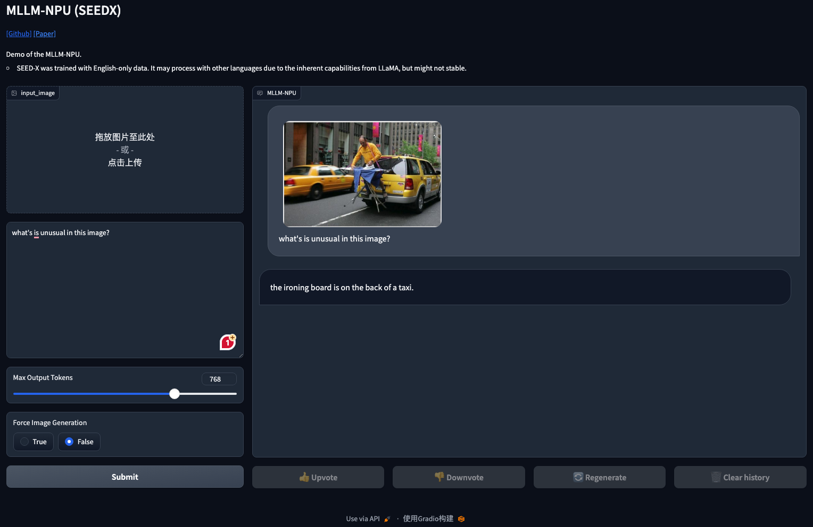
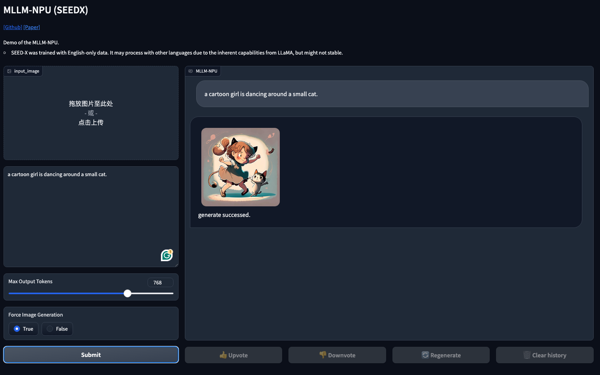
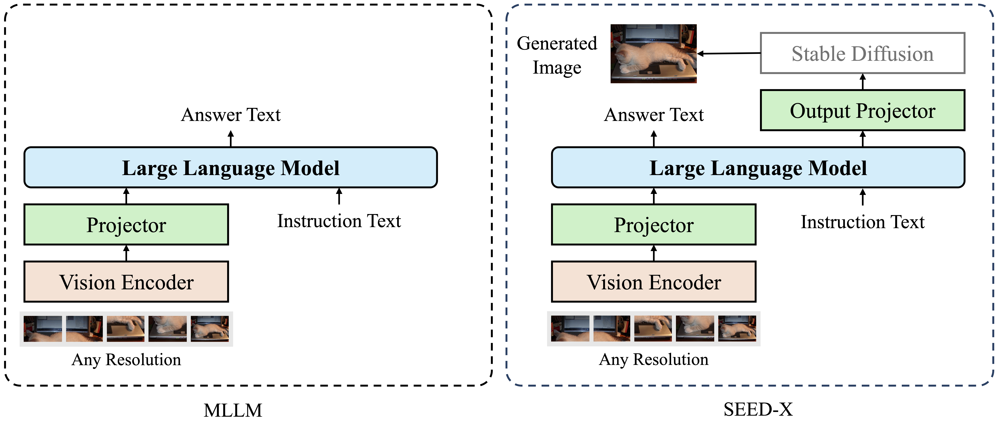

<p align="center">
    
</p>

<h3 align="center">Training Multimodal Large Language Models on Ascend NPUs</h3>

<p align="center">
    
</p>

<h4 align="center">
    <p>
        <a href="./README.md">English</a> |
        <a href="./README_ZH.md">中文</a>  
    </p>
</h4>

</br>

In recent years, the widespread use of NPUs has provided more training and usage resources for LLMs, especially MLLMs.
However, the current use of NPUs still has more or less adaptation issues.
Therefore, we provide a framework that can flexibly select different visual encoders, adapters, LLMs, and corresponding generation components to form MLLMs for training, inferring, and image generation.

For example, we give an implementation of a high-performance MLLM (i.e., SEED-X) using this framework. Of course, you can also choose different modules in this framework to build your own MLLM.

- MLLM: the standard multimodal large language models for multimodal comprehension.

- [SEED-X](https://github.com/AILab-CVC/SEED-X/tree/main): a unified and versatile foundation model which is capable of responding to a variety of user needs through unifying **multi-granularity comprehension and generation**.


## 🌟 Highlights

* **modular design**: this project is flexible and it's easy to change the large language models or vision encoders with configs.

* **training recipe** this project provides the complete code for pre-training or superivsed finetuning the multimodal large language models on (Ascend) NPUs.

* ****

## 📢 News

* **2024-07-08** 🔥 We release NPU-based multi-modal inference and pre-training code, and various ways to use SEED-X.

## 📋 TODOs

This project is **under active development**, please stay tuned ☕️!

- [ ] Model zoo on NPU.
- [ ] Multimodal benchmarks.


## 🔨 Install

- Dependencies & Environment
  - python >= 3.8 (Recommend to use [Anaconda](https://www.anaconda.com/download/#linux))
  - [torch = 2.1.0+cpu](https://pytorch.org/) + [torch-npu = 2.1.0](https://pypi.org/project/torch-npu/2.1.0/)
  - ASCEND NPU (Recommend to use [910B]()) + [CANN](https://www.hiascend.com/en/software/cann)
    - CANN version
    

    ```bash
    > cat /usr/local/Ascend/ascend-toolkit/latest/x86_64-linux/ascend_toolkit_install.info 
    package_name=Ascend-cann-toolkit
    version=8.0.T6
    innerversion=V100R001C17B214
    compatible_version=[V100R001C15,V100R001C18],[V100R001C30],[V100R001C13],[V100R003C11],[V100R001C29],[V100R001C10]
    arch=x86_64
    os=linux
    path=/usr/local/Ascend/ascend-toolkit/8.0.T6/x86_64-linux
    ```

- Installation
  - Clone the repo and install dependent packages

  ```bash
  git clone https://github.com/TencentARC/mllm-npu.git
  cd mllm-npu
  pip install -r requirements.txt
  ```

## 💻 Demo

### Quick Start

To quickly try out this framework, you can execute the following script.

```bash
# For image comprehension
python ./demo/img2txt_inference.py

# For image generation
python ./demo/txt2img_generation.py
```

### Gradio Web UI

To launch a Gradio demo locally, please run the following commands one by one. If you plan to launch multiple model workers to compare between different checkpoints, you only need to launch the controller and the web server ONCE.

1. Launch a contoller

    ```bash
    python mllm_npu/serve/controller.py --host 0.0.0.0 --port 10000
    ```

2. Launch a model worker

    ```bash
    python mllm_npu/serve/worker.py --host 0.0.0.0 --controller http://localhost:10000 --port 40000 --worker http://localhost:40000
    ```

3. Launch a gradio web app

    ```bash
    python mllm_npu/serve/gradio_app.py
    ```

4. You can also use this service through API, see [demo](./demo/demo.ipynb) for the format.

    ```json
    {
        "input_text": "put your input text here",
        "image": "put your input image (base64)",
        "image_gen": False or True
    }
    ```
   
<p align="center">
    
</p>

<p align="center">
    
</p>

## ⚙️ Model

We mainly adopt the `GeneraliazedMultimodalModels` in [mllm.py](./mllm_npu/models/mllm.py) as the general architecture of multimodal large language models, such as LLaVA, which contains three basic modules:
- (1) a **language model**, e.g., LLaMA-2.
- (2) a **projector** to project image features into language embeddings.
- (3) a **vision encoder**, e.g., ViT.

The MLLM is built according to the model config with `hydra.utils.instantiate`, and you can find some samples in [models](./mllm_npu/configs/models).

<div align="center"></div>

Specifically, we support two mainstream architectures now:

* standard multimodal models (`GeneraliazedMultimodalModels`): aim for multimodal comprehension, containing a vision encoder, a vision-language projector, and a Large Lagnguage Model.

* [SEED-X](https://github.com/AILab-CVC/SEED-X) (`SEED`): the versatile multimodal model for comprehension and generation, extends the standard multimodal model with a output projector for generating images with the stable diffusion.

    | Architecture | Any Resolution | Comprehension | Generation |
    | :----------- | :------------: | :-----------: | :--------: |
    | MLLM         | ✔️              | ✔️             | ✖️          |
    | SEED-X       | ✔️              | ✔️             | ✔️          |

## 🌐 Data

You can prepare your own data to pre-train or fine-tune your model. Specifically, we provide four different tasks and corresponding formats (please refer to the [examples](./data/)). In order to use the data more efficiently, we use [webdataset](https://webdataset.github.io/webdataset/) to organize the data. Besides, please refer to [data.yaml](./seed_npu/configs/dataset/pretrain_data.yaml) for the index of the data. You can adjust the data sampling rate and other settings by setting it in this file.

Please refer to [dataset](./data/data.md) for more data information.

## 🏃 Train

### Prepare Tokenizers

For multimodal comprehension, we need to add special tokens to the tokenizers, such as `` or `<patch>`, you can specify the path of the tokenizer in [scripts/tools/add_special_tokens_to_tokenizer.py](./scripts/tools/add_special_tokens_to_tokenizer.py) and directly run this scripts to obtain the updated tokenizer.

### Pre-training
You need to specify the **model config** and **data config** in the training scripts, such as [`scripts/mllm_llama3_8b_siglip_vit_pretrain.sh`](./scripts/mllm_llama3_8b_siglip_vit_pretrain.sh).

```bash
bash scripts/mllm_llama3_8b_siglip_vit_pretrain.sh
```

### Supervised Finetuning / Instruction Tuning

For supervised finetuning,  you can keep most settings unchanged and:

1. specify the initial weights of SFT through the "pretrained_model_name_path" in the model configuration file.  
2. adjust the SFT data and its instruction format.  
3. follow the pre-training script for the rest.

## 🌟 Benchmark Evaluation
coming soon


## 💡 Citation

If you find the work helpful, please consider citing:

- mllm-npu

    ```bibtex
    @misc{mllm_npu
        title={mllm-npu},
        author={Li, Chen and Cheng, Tianheng and Ge, Yuying and Wang, Teng and Ge, Yixiao},
        howpublished={\url{https://github.com/TencentARC/mllm-npu}},
        year={2024},
    }
    ```

- SEED-X

    ```bibtex
    @article{ge2024seed,
        title={SEED-X: Multimodal Models with Unified Multi-granularity Comprehension and Generation},
        author={Ge, Yuying and Zhao, Sijie and Zhu, Jinguo and Ge, Yixiao and Yi, Kun and Song, Lin and Li, Chen and Ding, Xiaohan and Shan, Ying},
        journal={arXiv preprint arXiv:2404.14396},
        year={2024}
    }
    ```

## 🔎 License
This project is under the Apache-2.0 License. For models built with LLaMA or Qwen models, please also adhere to their licenses!


## 👍 Acknowledgement

This project is developed based on the source code of [SEED-X]().


