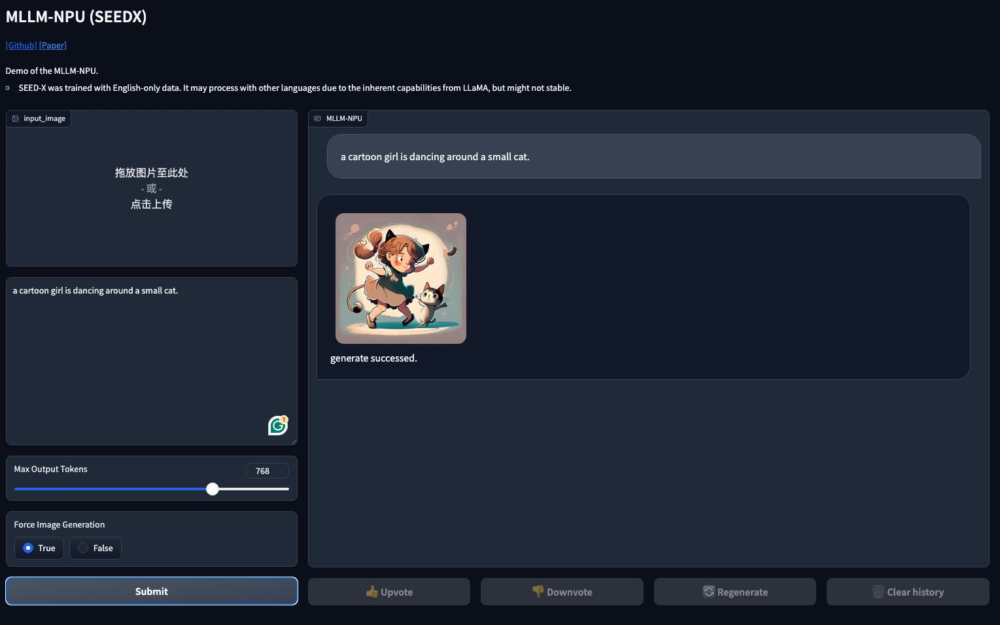

<p align="center">
    
</p>

<h3 align="center">使用Ascend NPUs训练多模态大模型</h3>

<p align="center">
    
</p>

<h4 align="center">
    <p>
        <a href="https://github.com/TencentARC/mllm-npu/edit/main/README.md">English</a> |
        <a href="https://github.com/TencentARC/mllm-npu/edit/main/README_ZH.md">中文</a> 
    </p>
</h4>

</br>

近年来，NPU的广泛使用为LLM，特别是MLLM提供了更多的训练和使用资源。
但目前NPU的使用还存在或多或少的适配问题。
因此，我们提供了一个框架，可以灵活地选择不同的视觉编码器、适配器、LLM和相应的生成组件，组成MLLM进行训练、推理和图像生成。

例如，我们给出了一个基于该框架的高性能MLLM（即SEED-X）的实现。当然，您也可以选择该框架中的不同模块来构建您自己的MLLM。

- MLLM：用于多模式理解的标准多模式大型语言模型。

- [SEED-X](https://github.com/AILab-CVC/SEED-X/tree/main): 一个统一的、通用的基础模型，通过统一的**多粒度理解和生成**，能够响应各种用户需求。


## 🌟 亮点

* **模块化设计**: 该项目非常灵活，可以轻松地通过配置更改大型语言模型或视觉编码器。

* **训练秘诀** 该项目提供了在（Ascend）NPU 上对多模态大型语言模型进行预训练或监督微调的完整代码。

* ****

## 📢 最新

* **2024-07-08** 🔥 我们发布基于NPU的多模态推理和预训练代码，以及使用SEED-X的多种方式。

## 📋 待完成

该项目**正在积极开发中**，敬请期待☕️！

- [ ] NPU上的模型库。
- [ ] 多模态评测。


## 🔨 安装

- 依赖项和环境
  - python >= 3.8 (推荐使用[Anaconda](https://www.anaconda.com/download/#linux))
  - [torch = 2.1.0+cpu](https://pytorch.org/) + [torch-npu = 2.1.0](https://pypi.org/project/torch-npu/2.1.0/)
  - ASCEND NPU (推荐使用[910B]()) + [CANN](https://www.hiascend.com/en/software/cann)
    - CANN版本
    
    ```bash
    > cat /usr/local/Ascend/ascend-toolkit/latest/x86_64-linux/ascend_toolkit_install.info 
    package_name=Ascend-cann-toolkit
    version=8.0.T6
    innerversion=V100R001C17B214
    compatible_version=[V100R001C15,V100R001C18],[V100R001C30],[V100R001C13],[V100R003C11],[V100R001C29],[V100R001C10]
    arch=x86_64
    os=linux
    path=/usr/local/Ascend/ascend-toolkit/8.0.T6/x86_64-linux
    ```

- 安装
  - 克隆仓库并安装依赖包

  ```bash
  git clone https://github.com/TencentARC/mllm-npu.git
  cd mllm-npu
  pip install -r requirements.txt
  ```

## 💻 示例演示

### 快速开始

为了快速试用这个框架，您可以执行以下脚本。

```bash
# 图像理解
python ./demo/img2txt_inference.py

# 图像生成
python ./demo/txt2img_generation.py
```

### Gradio Web UI

要在本地启动 Gradio 演示，请逐个运行以下命令。如果您计划启动多个模型工作器来比较不同的检查点，则只需启动控制器和 Web 服务器一次。

1. 启动 contoller

    ```bash
    python mllm_npu/serve/controller.py --host 0.0.0.0 --port 10000
    ```

2. 启动一个 model worker

    ```bash
    python mllm_npu/serve/worker.py --host 0.0.0.0 --controller http://localhost:10000 --port 40000 --worker http://localhost:40000
    ```

3. 启动一个 gradio 页面应用

    ```bash
    python mllm_npu/serve/gradio_app.py
    ```

4. 您也可以通过API使用该服务，格式请参见 [demo](./demo/demo.ipynb)

    ```json
    {
        "input_text": "put your input text here",
        "image": "put your input image (base64)",
        "image_gen": False or True
    }
    ```
   
<p align="center">
    
</p>

<p align="center">
    
</p>

## ⚙️ 模型

我们主要采用 [mllm.py](./mllm_npu/models/mllm.py) 中的 `GeneraliazedMultimodalModels` 作为多模态大型语言模型的通用架构，例如 LLaVA，它包含三个基本模块：
- (1) 一个**大语言模型**, e.g., LLaMA-2；
- (2) 一个**映射层**将图像投影到输入表征；
- (3) 一个**视觉编码器**, e.g., ViT。

MLLM 是根据使用 `hydra.utils.instantiate` 的模型配置构建的，你可以在 [models](./mllm_npu/configs/models) 中找到一些示例。

<div align="center"></div>

具体来说，我们现在支持两种主流的架构：

* 标准多模态模型（`GeneraliazedMultimodalModels`）：旨在实现多模态理解，包含视觉编码器、视觉语言投影仪和大型语言模型。

* [SEED-X](https://github.com/AILab-CVC/SEED-X) (`SEED`)：用于理解和生成的多功能多模态模型，通过输出投影仪扩展标准多模态模型，以生成具有稳定扩散的图像。

    | 架构 | 任意分辨率 | 理解 | 生成 |
    | :----------- | :------------: | :-----------: | :--------: |
    | MLLM         | ✔️              | ✔️             | ✖️          |
    | SEED-X       | ✔️              | ✔️             | ✔️          |

## 🌐 数据

你可以准备自己的数据来预训练或微调你的模型。具体来说，我们提供了四种不同的任务和相应的格式（请参考 [examples](./data/)）。为了更有效地使用数据，我们使用 [webdataset](https://webdataset.github.io/webdataset/) 来组织数据。此外，数据的索引请参考 [data.yaml](./seed_npu/configs/dataset/pretrain_data.yaml)。你可以通过在此文件中设置来调整数据采样率和其他设置。

更多数据信息请参考[数据集](./data/data.md)。

## 🏃 训练

### 准备 Tokenizers

对于多模态理解，我们需要向标记器添加特殊标记，例如 `` 或 `<patch>`，您可以在 [scripts/tools/add_special_tokens_to_tokenizer.py](./scripts/tools/add_special_tokens_to_tokenizer.py) 中指定标记器的路径，然后直接运行此脚本以获取更新的标记器。

### 预训练
你需要在训练脚本中指定**模型配置**和**数据配置**，例如[`scripts/mllm_llama3_8b_siglip_vit_pretrain.sh`](./scripts/mllm_llama3_8b_siglip_vit_pretrain.sh)。

```bash
bash scripts/mllm_llama3_8b_siglip_vit_pretrain.sh
```

### 有监督微调/指令微调

对于有监督微调，您可以保持大多数设置不变，然后：

1. 通过模型配置文件中的“pretrained_model_name_path”指定 SFT 的初始权重。
2. 调整 SFT 数据及其指令格式。
3. 其余操作按照预训练脚本进行。

## 🌟 评估
coming soon


## 💡 应用

如果您发现该作品有帮助，请考虑引用：

- mllm-npu

    ```bibtex
    @misc{mllm_npu
        title={mllm-npu},
        author={Li, Chen and Cheng, Tianheng and Ge, Yuying and Wang, Teng and Ge, Yixiao},
        howpublished={\url{https://github.com/TencentARC/mllm-npu}},
        year={2024},
    }
    ```

- SEED-X

    ```bibtex
    @article{ge2024seed,
        title={SEED-X: Multimodal Models with Unified Multi-granularity Comprehension and Generation},
        author={Ge, Yuying and Zhao, Sijie and Zhu, Jinguo and Ge, Yixiao and Yi, Kun and Song, Lin and Li, Chen and Ding, Xiaohan and Shan, Ying},
        journal={arXiv preprint arXiv:2404.14396},
        year={2024}
    }
    ```

## 🔎 License
该项目遵循 Apache-2.0 许可证。对于使用 LLaMA 或 Qwen 模型构建的模型，也请遵守其许可证！

## 👍 感谢

本项目是基于 [SEED-X](https://github.com/AILab-CVC/SEED-X) 源代码开发的。


